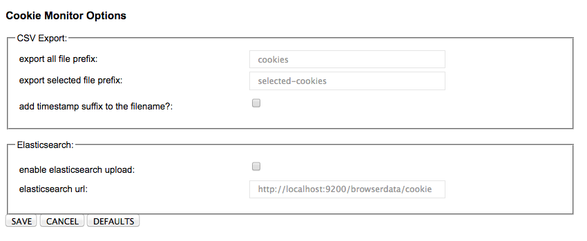

# Cookie Monitor

Cookie Monitor collects and displays cookie events happening in the browser.

Features:

  * Tabular display of event time, name, ... as they come in
  * Event counter in extension badge
  * Sort events
  * Group events
  * Export events to csv file
  * Export events to Elasticsearch
  * Csv filename and elasticsearch target configurable

### Motivation

At the time I wrote this there existed a lot of tools handling cookies - either displaying, modifying or blocking them. But I did not find any focusing on the cookie event. How often is a cookie set? What different cookies are set on a website? Which domains are used?

Cookie Monitor displays exactly those cookie event - every single one of them!

For example try to navigate to one of the video streaming sites (e.g. netflix.com or watchever.de) or any other "heavy site" and have a look at the counter badge. Or try to find the site that tries to reach the immortal users by using expire dates on the cookies which are way beyond the life expectancy of a human being.  :-)

Those findings lead to the idea to hook this up to some tools specialized in analysing events ([elasticsearch](http://www.elasticsearch.org)). With this you can answer questions like the above or get infos on the sites to visited and how those site use cookies. You can even display those in nice dashboards like [kibana](http://www.elasticsearch.org/overview/kibana/) - imagine a dashboard displaying the top 10 sites with regards to "cookie events per minute". Hmm ... who would win here? ;-)

Cookie Monitor to me is also a playground to experiment with browser extensions (opera/chrome style), the javascript toolchain (grunt, ...) and simply keeping in touch with developing trends.

I developed this about half a year ago and its definitely not very pretty and looking at it now there are many things I would do differenty now. But it works and gives me a lot of insight into the way cookies are used on web pages. Therefore I decided to put this up. Maybe this is of some use for anybody else - even in the current state.

Have fun!  ;-)

### Screenshots

#### Main Display

  * A tabular view of the cookie events ordered by the time they occured. 
  * Change the sort order by selecting the column header.
  * Buttons to clear or export all data. 
  * Exports are automatically stored in download folder (see preferences).
  * Mouseover details at the bottom of the window.
  * Cookie events without any expiration or with a negative one are displayed in red.
  * The badge above the extensions icon shows the total number of events.

#### Selecting Events

  * Bottons to export the selected events or clear the selection.
  * Details for every selected event is display at the bottom.
  * 

#### Grouping Events
  * Drag column header to table to to group by that column.
  * Alternatively use the menu icon in the top right to group or change group order.
  * Number of elements within is displayed at the end of the line.
  * Drill Down to a event by opening/closing the groups.
  

#### Options
  * _export all file prefix_ : use this as filename when exporting all events.
  * _export selected file prefix_ : use this as filename when exporting selected events.
  * _add timestamp suffix to the filename_ : use this if you want the export timestamp to be added to the filename.
  * _enable elasticsearch upload_ : activate the elasticsearch client.
  * _elasticsearch url_: URL to use when sending the json formatted event as http post.
  

### Usage

You need to have installed: _[npm](http://www.nodejs.org)_, _[bower](http://bower.io)_ and _[grunt](http://gruntjs.com)_.

    1. git clone https://github.com/olafstauffer/cookie-monitor.git 
    2. cd cookie-monitor 
    3. npm install 
    4. bower install 
    5. grunt 
    6. activate developer mode on browser extensions page (see e.g. [this article](http://techdows.com/2013/12/chrome-disable-developer-mode-extensions.html)). 
    7. use "Load Unpacked Extension" and navigate to ..../cookie-monitor/app
  

### Testing

Right now only e2e test using protractor (webdriver) are being executed.
To test the extensions popup page we first have to find the url for this
(e.g. chrome-extension://kpdpnnannoiaapakjkkiggimlcggagjb/popup.html ).
The tricky part is the extension id - as this changes everytime run the 
test. 

Therefore on startup this id is scraped from the internal extension
overview url (chrome://extensions resp. chrome:/extensions-frame).

Then the popup url is constructed and the tests are performed with
protractor.

Unfortunatelly there are two problems here:

1. protractor cannot sync to the internal page
   A call to "browser.driver.get(popupUrl)" works, but a call to "browser.get(popupUrl)" does not. Therefore the tests can only see the inital page, not
   the angular app page.
2. webdriver does not emit a "onCookieChanged" event
   webdriver can add cookies or call a page that sets cookie, but the event
   os never fired - unfortunatelly this extension depends on it.

Maybe I'm not using protractor/webdriver correctly or maybe there are bugs in
those tools, but right now thats the way it is.

This means right now (automatic) testing is extremely limited. Only the
existance of some vital element of the popup is tested. And there is dev code 
to add some test cookies to the model to make (manual) testing easier.
(This dev code is automatically removed from the distributed version)

#### Run Tests

    1. Prepare Webdriver:
        ./node_modules/protractor/bin/webdriver-manager update

    2. Start the Selenium server:
        ./node_modules/protractor/bin/webdriver-manager start

    3. Run Test:
        grunt test

### Internals

Cookie Monitor is build around the _onChanged_ event of the [chrome cookies api](http://developer.chrome.com/extensions/cookies.html). This event does not provide a reference to the page that caused the event to happen. Cookie Monitor guesses the page by looking at the active browser tab when the event occures. If you need reliable information about the page source you must not use more than a single browser tab.

To transport the event data to elasticsearch the data is simply converted into a json string and then send to the elasticsearch rest api. The mapping and the definition of a record id is done automatically by elasticsearch. 
Use [this url](http://localhost:9200/browserdata/cookie/_search?pretty=1) to perform a simple elasticsearch query.

### Icons used

* Cookie Icon (Alessandro Rei - http://www.kde-look.org/usermanager/search.php?username=mentalrey)

* BeOS Pulse Icon (Symbolpaket:BeOSDesigner:Matthew McClintockLizenz:Freeware, http://findicons.com/icon/258317/beos_pulse?id=428315)

* Oscilloscope Icon (Symbolpaket:ReflectionDesigner:webdesignerdepot.comLizenz:Freeware, http://findicons.com/icon/440685/oscilloscope?id=449683)

* Monitor Icon (http://www.iconattitude.com/icons/ico/6664/utilities-system-monitor.html)

### Versions

 * 0.5 Refactored cookie event functionality into CookieEvent class 
 * 0.4 Add upload to Elasticsearch
 * 0.3 Add options.html
 * 0.2 Add csv export